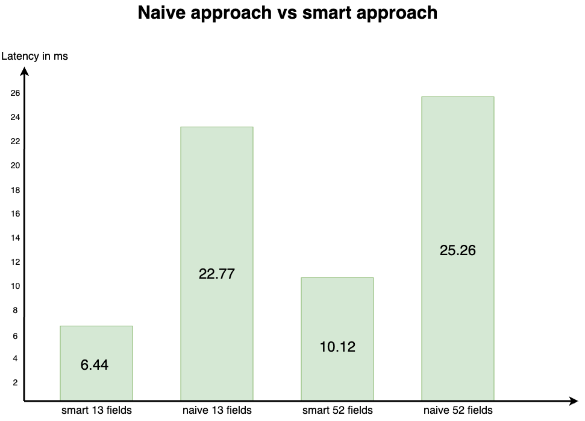

This module was implemented to measure the performance improvement of the separation of PAP/PDP and PEP.

The so-called naive approach generates the token based on a policy in the interceptor itself and, consequently, at every 
request. We performed experiments within the same environment as described in our report and used the same measurement 
mechanism. 

The results are as follows:

The results show a significant difference between both approaches while the number of fields does not seem to make a big
difference at the naive approach. Consequently, the token generation itself seem to have a more or less fixed impact. 
However, we have not tested a very large policy with dozens of services and purposes which would probably increase the
latency of the naive approach even further. 